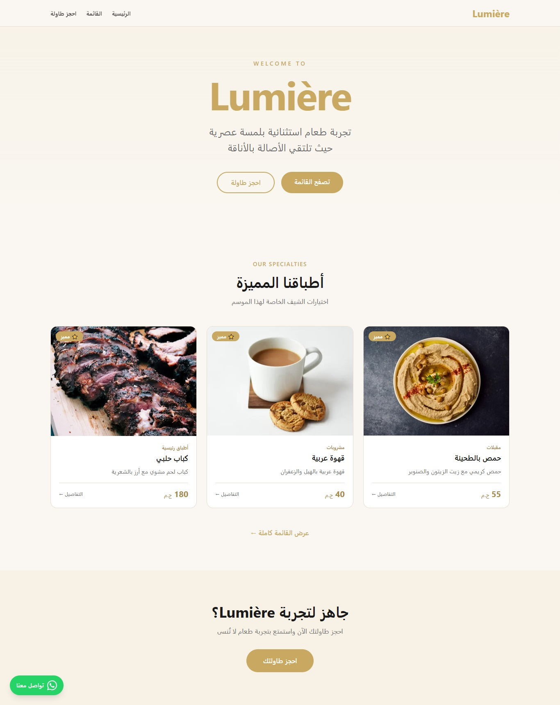
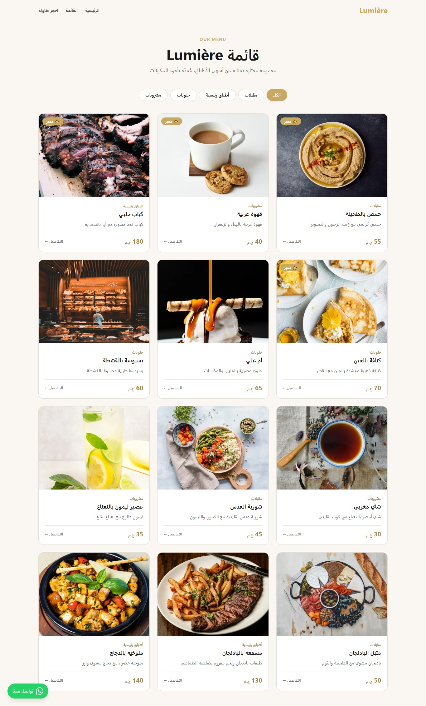
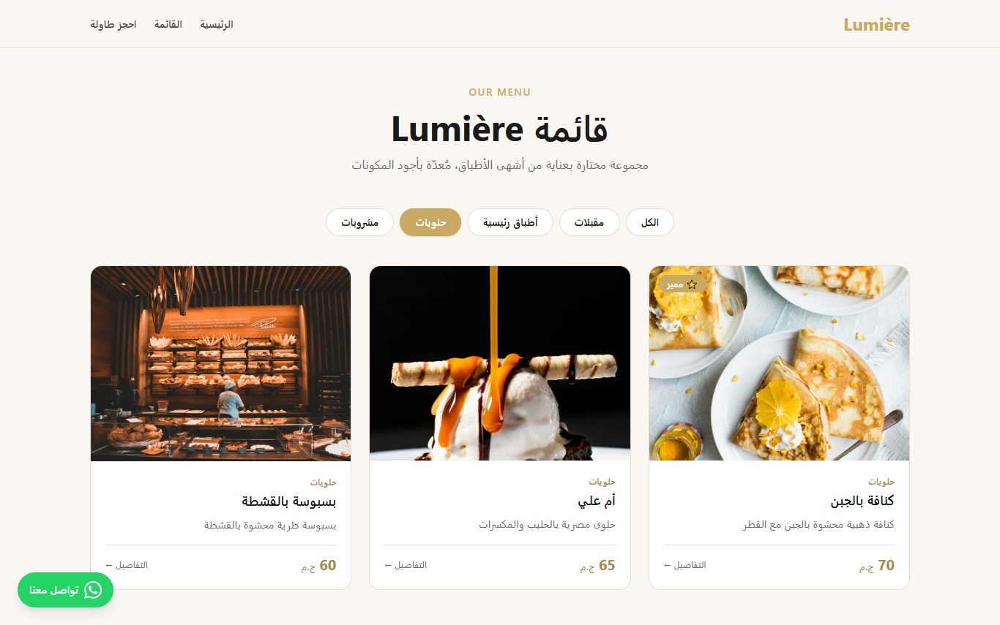
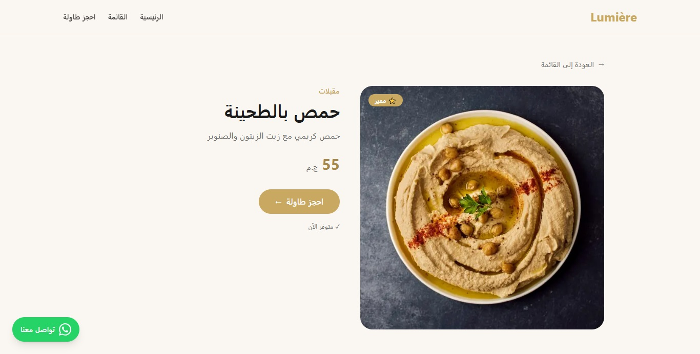
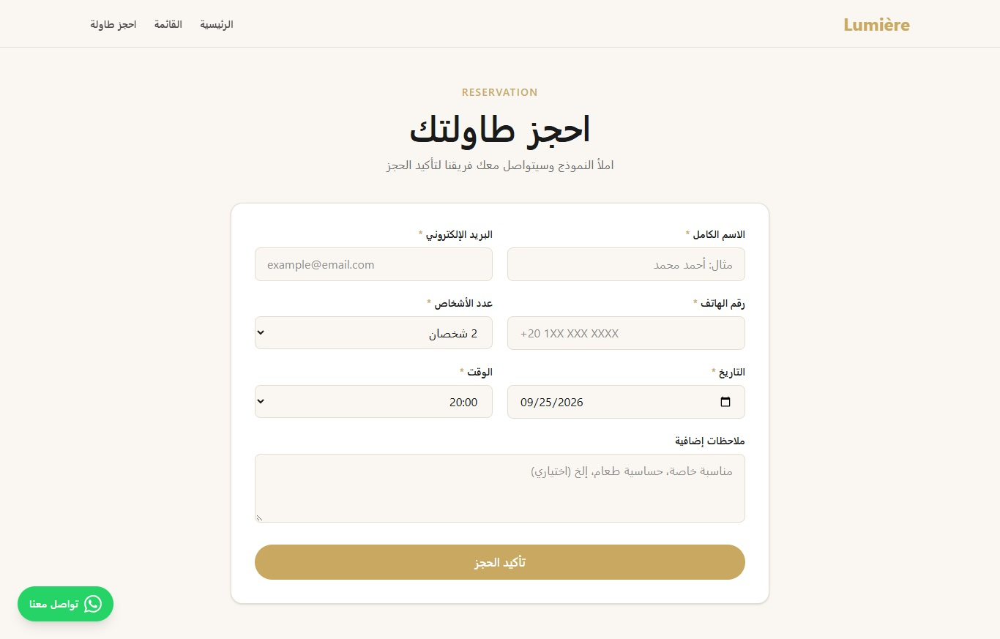
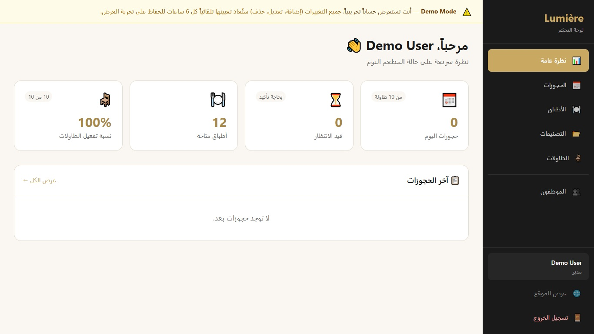
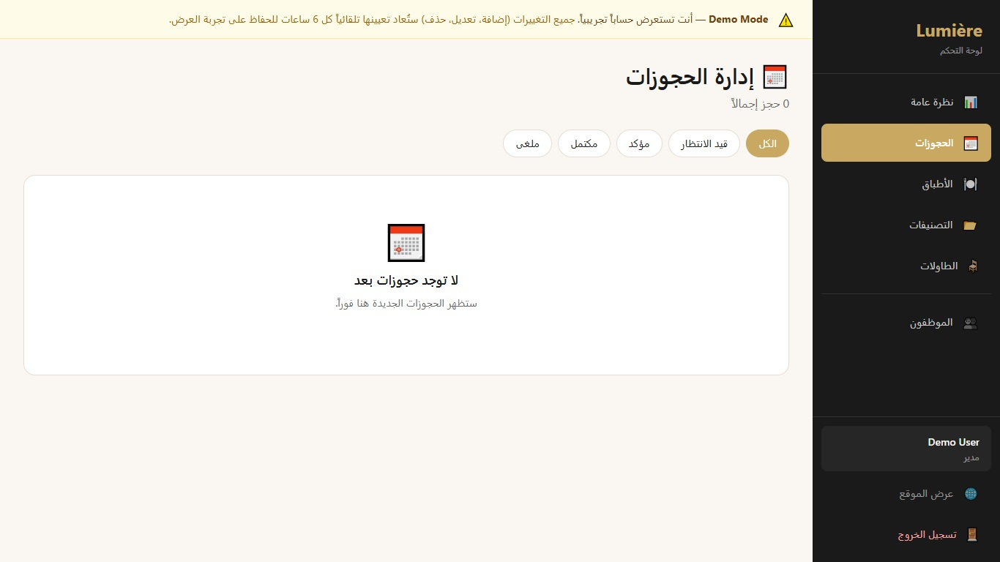
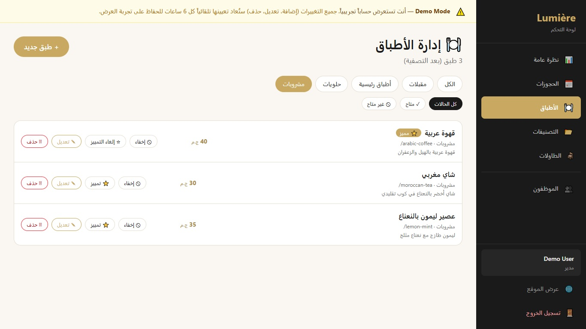
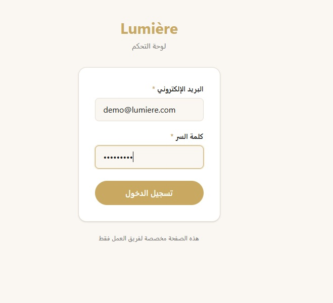
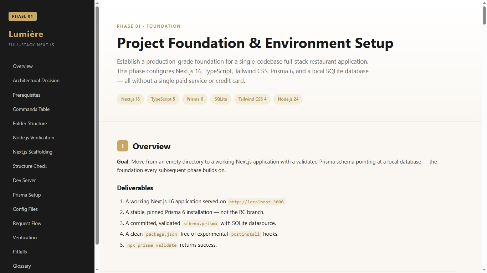

# 🍽️ Lumière Restaurant — Full-Stack Next.js Application

> A production-ready restaurant website with an intelligent table-assignment engine, complete admin dashboard, authentication, and email notifications. Deployed on Vercel with Neon PostgreSQL, featuring full RTL Arabic UI.

[](https://lumiere-nextjs-fullstack.vercel.app)
[](./portfolio)
[](https://github.com/myhifi/lumiere-nextjs-fullstack)

[](https://nextjs.org)
[](https://www.typescriptlang.org)
[](https://www.prisma.io)
[](https://www.postgresql.org)
[](https://tailwindcss.com)
[](https://github.com/myhifi/lumiere-nextjs-fullstack/actions/workflows/ci.yml)

---

## 🌐 Live Demo

| Environment | URL |
|---|---|
| **Production** | https://lumiere-nextjs-fullstack.vercel.app |
| **Menu** | https://lumiere-nextjs-fullstack.vercel.app/menu |
| **Reservation** | https://lumiere-nextjs-fullstack.vercel.app/reserve |
| **Admin Dashboard** | https://lumiere-nextjs-fullstack.vercel.app/admin |
| **Full Project Walkthrough** | [Phase 1 → Phase 10](https://lumiere-nextjs-fullstack.vercel.app/portfolio/phase-10-polishing.html) |
---

## 📸 Screenshots

### Customer-Facing






### Admin Dashboard





### Documentation



## ✨ Features

### Customer-Facing

- 🍽️ **Menu browsing** with category filtering (4 categories, 12 dishes)
- 🔍 **Item detail pages** with dynamic routing and rich descriptions
- 📅 **Smart reservation engine** — auto-assigns the optimal table based on party size, time slot, and existing bookings (interval-overlap algorithm)
- 📧 **Email confirmation** on reservation (console provider in development)
- 💬 **WhatsApp integration** — floating button on every page
- 🌍 **Full RTL Arabic UI** — right-to-left layout, Arabic typography, culturally-aware design

### Admin Dashboard

- 📊 **Dashboard overview** with real-time statistics
- 📅 **Reservations management** — status lifecycle: pending → confirmed → completed (or cancelled)
- 🍽️ **Menu management** — full CRUD with availability toggle, featured toggle, auto-slugs
- 📂 **Categories management** — with cascade-delete protection
- 🪑 **Tables management** — with reservation-history protection
- 👥 **Users management** — role-based access (ADMIN/STAFF) with three-tier safety rules
- 🔐 **Authentication** — Auth.js v5 with credentials, bcrypt hashing, JWT sessions

### Engineering

- ⚡ **Server Components** — zero client JavaScript for static content
- 🔒 **Defense-in-depth security** — five layers from client to business rule
- ✅ **Zod validation** — Arabic error messages, custom refinements
- 🔄 **Auto-deploy** — one `git push` triggers full CI/CD pipeline
- 📱 **Responsive** — mobile-first with three breakpoints
- ♿ **Accessibility** — ARIA labels, semantic HTML, keyboard navigation

---

## 🏗️ Tech Stack

| Layer | Technology | Purpose |
|---|---|---|
| **Framework** | Next.js 16 (App Router) | Full-stack framework |
| **Language** | TypeScript 5 | Type safety across the stack |
| **Database** | PostgreSQL 17 (Neon) | Serverless relational database |
| **ORM** | Prisma 6 | Type-safe database client |
| **Validation** | Zod 4 | Runtime schema validation |
| **Styling** | Tailwind CSS 4 | Utility-first CSS with RTL support |
| **Auth** | Auth.js v5 (NextAuth) | Credential-based authentication |
| **Email** | React Email + Resend | Transactional email templates |
| **Hosting** | Vercel | Serverless deployment with CDN |
| **Source Control** | GitHub | Version control and collaboration |

---

## 🗺️ Architecture

```
Browser
   │
   ├── Public pages      → Server Components → Prisma → PostgreSQL
   ├── Reservation form  → Server Action     → Smart engine → Prisma
   └── Admin dashboard   → Auth.js + RBAC    → Server Actions → Prisma

Deployment:
Git push → GitHub → Vercel Build → Production URL
```

### Key Architectural Decisions

- **Single codebase** — Next.js handles both frontend and backend
- **Server Components by default** — only interactive leaves become Client Components
- **Pure business logic** — `findBestTable()` has no knowledge of HTTP or the database
- **Server Actions over API routes** — for internal mutations
- **Route Handlers for external consumers** — `/api/menu/*` for third parties

---

## 📚 Project Documentation

This project was built in **10 documented phases**, each with a self-contained HTML portfolio page:

| Phase | Topic | Documentation |
|---|---|---|
| 1 | Foundation & Environment Setup | [Open](./public/portfolio/phase-01-foundation.html) |
| 2 | Data Modeling (Prisma Schema) | [Open](./public/portfolio/phase-02-data-modeling.html) |
| 3 | API Layer (Route Handlers) | [Open](./public/portfolio/phase-03-api-layer.html) |
| 4 | Frontend (Server Components) | [Open](./public/portfolio/phase-04-frontend.html) |
| 5 | Reservation Engine (Smart Logic) | [Open](./public/portfolio/phase-05-reservation-engine.html) |
| 6 | Email + WhatsApp Integration | [Open](./public/portfolio/phase-06-email-whatsapp.html) |
| 7 | Authentication (Auth.js v5) | [Open](./public/portfolio/phase-07-authentication.html) |
| 8 | Admin Dashboard (Full CRUD) | [Open](./public/portfolio/phase-08-admin-dashboard.html) |
| 9 | Deployment (Vercel + Neon) | [Open](./public/portfolio/phase-09-deployment.html) |
| 10 | Polishing & Production Readiness | [Open](./public/portfolio/phase-10-polishing.html) |

> **View on GitHub:** each HTML file renders as formatted source. **View on Vercel:** [open the live version](https://lumiere-nextjs-fullstack.vercel.app/portfolio/phase-10-polishing.html) to browse all phases as designed pages with sidebar navigation including architecture diagrams, code examples, and engineering rationale.

---

## 🚀 Getting Started

### Prerequisites

- Node.js 18.17+ (recommended: 20+)
- npm 9+
- A PostgreSQL database (Neon free tier recommended)

### Installation

```bash
git clone https://github.com/myhifi/lumiere-nextjs-fullstack.git
cd lumiere-nextjs-fullstack

npm install

cp .env.example .env

npx prisma migrate dev

npm run db:seed

npm run db:admin

npm run dev
```

Open http://localhost:3000 in your browser.

### Admin Access

After running `npm run db:admin`, log in at `/login` with:
### Demo Access

For portfolio review, use this account to explore the full admin dashboard:

- **Email:** `demo@lumiere.com`
- **Password:** `Demo2026!`

> ⚠️ **Demo mode:** This account is provided for portfolio review only. All changes are automatically reset every 6 hours to preserve the demo experience. The production admin account is not published.

---

## 🔐 Environment Variables

| Variable | Purpose | Required |
|---|---|---|
| `DATABASE_URL` | PostgreSQL connection string | ✅ |
| `DIRECT_URL` | Direct connection for migrations | ✅ |
| `AUTH_SECRET` | JWT signing secret (64+ chars) | ✅ |
| `EMAIL_PROVIDER` | `console` (dev) or `resend` (prod) | ✅ |
| `NEXT_PUBLIC_SITE_URL` | Public URL for OG images and sitemap | Optional |

Generate `AUTH_SECRET` with:

```bash
node -e "console.log(require('crypto').randomBytes(32).toString('base64'))"
```

---

## 📁 Project Structure

```
lumiere-nextjs-fullstack/
├── portfolio/              # 9 HTML portfolio pages (one per phase)
├── prisma/
│   ├── schema.prisma       # Database schema (5 models)
│   ├── migrations/         # Versioned migrations
│   ├── seed.ts             # Seed script
│   └── data/               # Seed data (categories, items, tables)
├── scripts/
│   ├── create-admin.ts     # Idempotent admin seeder
│   └── test-*.ts           # Test scripts for pure functions
├── src/
│   ├── actions/            # Server Actions
│   ├── app/
│   │   ├── (public)/       # Customer-facing pages
│   │   ├── (auth)/         # Login page
│   │   ├── admin/          # Protected admin dashboard
│   │   └── api/            # Route Handlers
│   ├── components/         # Reusable React components
│   ├── lib/                # Business logic + utilities
│   ├── types/              # TypeScript augmentations
│   ├── auth.config.ts      # Edge-safe Auth.js config
│   ├── auth.ts             # Node-only Auth.js config
│   └── proxy.ts           # Route protection
└── package.json
```

---

## 🧪 Testing

The project includes test scripts for pure business logic:

```bash
npx tsx scripts/test-assignment.ts

npx tsx scripts/test-validation.ts

npx tsx scripts/test-password.ts
```

All scripts print pass/fail for each scenario and exit with a non-zero code on failure.

---

## 📄 License

This project is licensed under the MIT License.

---

## 👤 Author

**Mohamed Yehia (myhifi)**

- **GitHub:** [@myhifi](https://github.com/myhifi)
- **Live Project:** [lumiere-nextjs-fullstack.vercel.app](https://lumiere-nextjs-fullstack.vercel.app)

---

## 🙏 Acknowledgments

- Built as a portfolio project to demonstrate full-stack Next.js proficiency
- Deployed entirely on free tiers: **Vercel**, **Neon**, **GitHub**
- Zero external paid services, zero credit card requirements

---

<div align="center">

**⭐ If you find this project useful, please consider giving it a star! ⭐**

Made with ❤️ and TypeScript

</div>