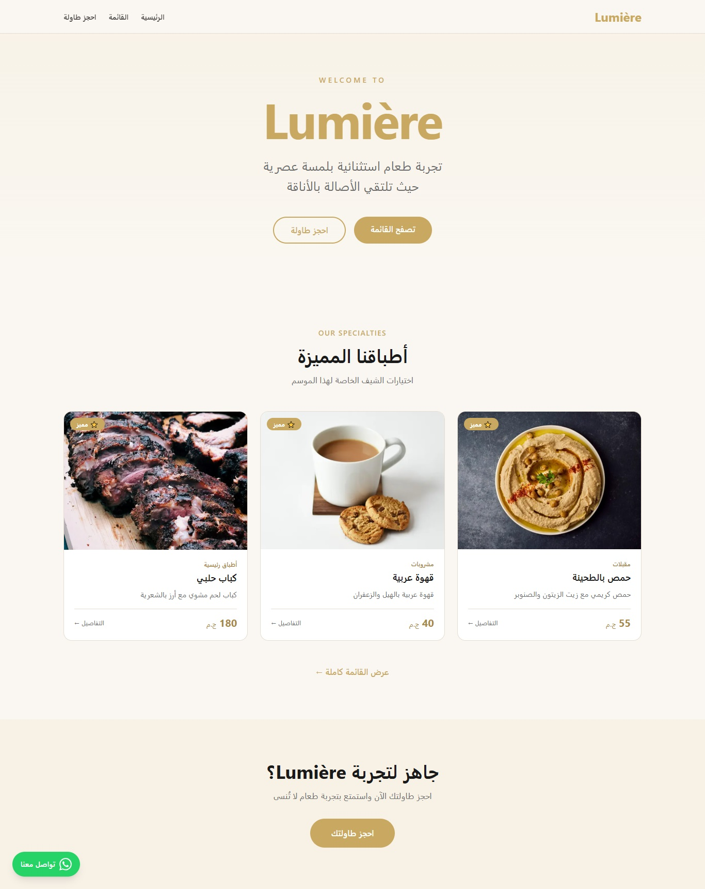
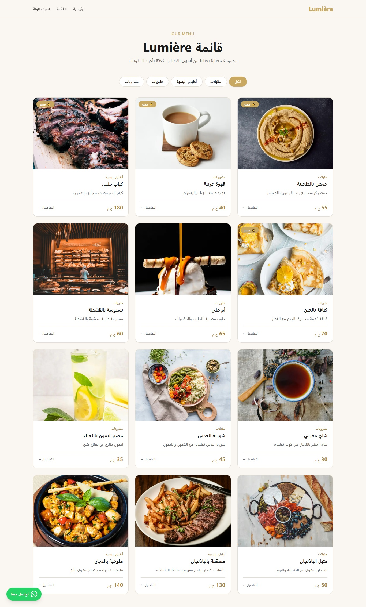
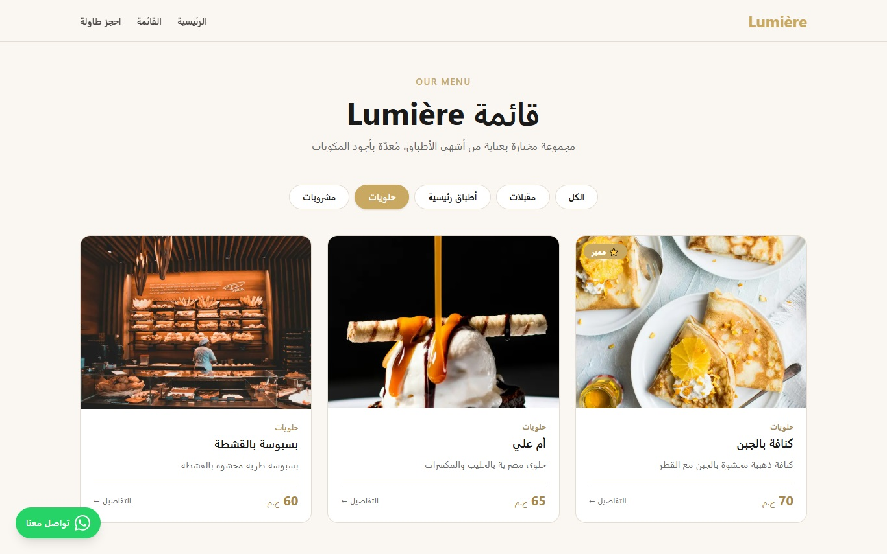
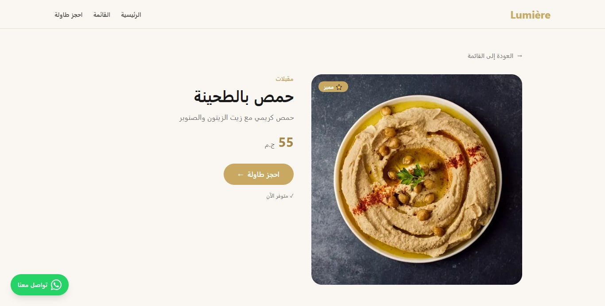
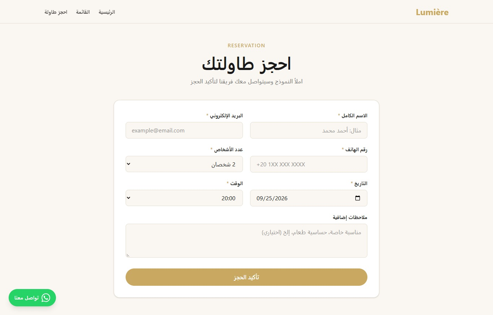
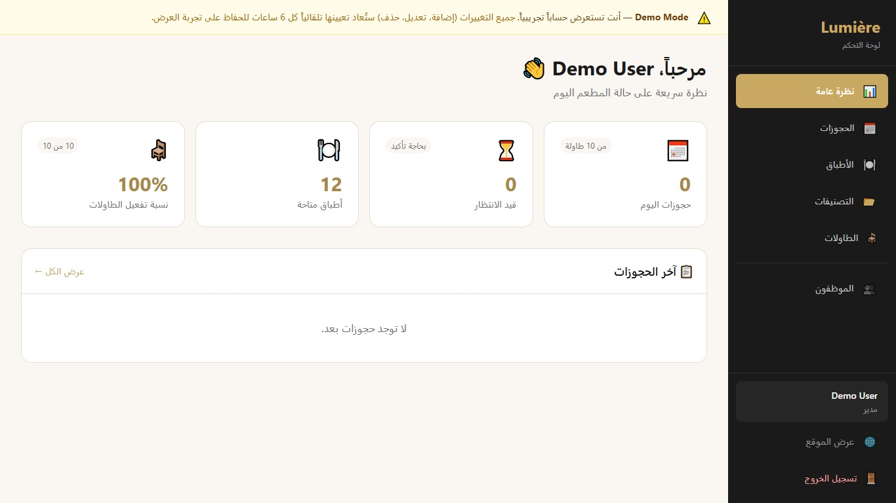
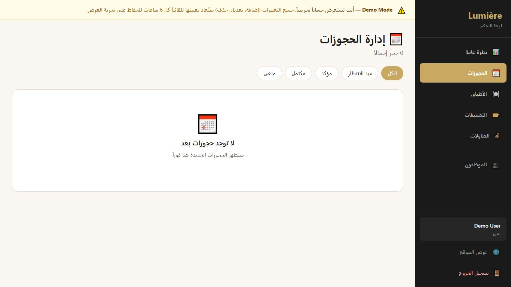
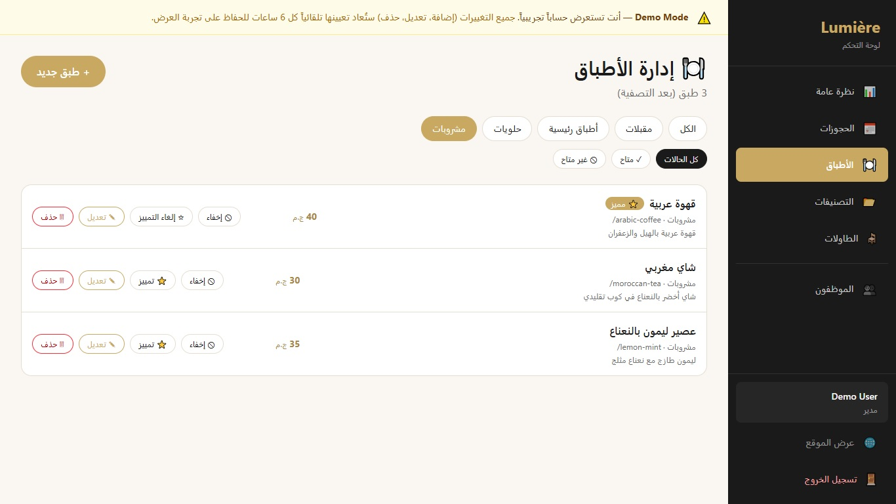
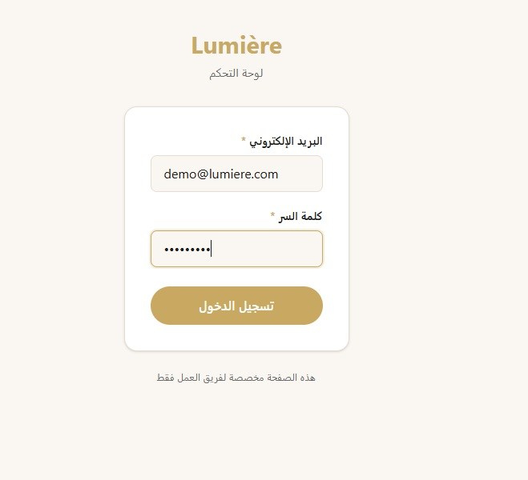
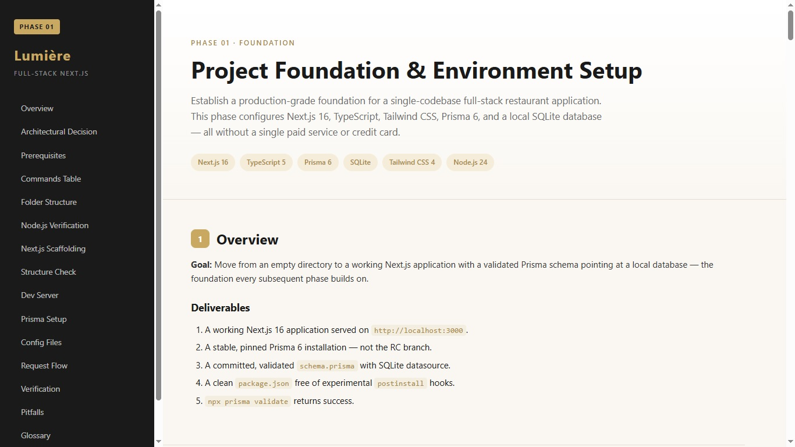

# 🍽️ Lumière Restaurant — Full-Stack Next.js Application

> A production-ready, bilingual (Arabic + English), 7-locale restaurant platform with an intelligent table-assignment engine, a zero-download Smart FAQ Assistant, complete admin dashboard, authentication, email notifications, and About page. Built with Next.js 16, Prisma, and PostgreSQL. Deployed on Vercel. Full RTL/LTR support.

[](https://lumiere-nextjs-fullstack.vercel.app)
[](https://lumiere-nextjs-fullstack.vercel.app/portfolio/phase-12-menu-about.html)
[](https://github.com/myhifi/lumiere-nextjs-fullstack)

[](https://nextjs.org)
[](https://www.typescriptlang.org)
[](https://www.prisma.io)
[](https://www.postgresql.org)
[](https://tailwindcss.com)
[](https://next-intl-docs.vercel.app)
[](https://lumiere-nextjs-fullstack.vercel.app)
[](https://lumiere-nextjs-fullstack.vercel.app/en/about)
[](https://github.com/myhifi/lumiere-nextjs-fullstack/actions/workflows/ci.yml)

---

## 🌐 Live Demo

| Page | URL |
|---|---|
| **Homepage** | https://lumiere-nextjs-fullstack.vercel.app |
| **Menu** | https://lumiere-nextjs-fullstack.vercel.app/en/menu |
| **Reservation** | https://lumiere-nextjs-fullstack.vercel.app/en/reserve |
| **About** | https://lumiere-nextjs-fullstack.vercel.app/en/about |
| **Admin Dashboard** | https://lumiere-nextjs-fullstack.vercel.app/en/admin |
| **Full Project Walkthrough** | [Phase 1 → Phase 12](https://lumiere-nextjs-fullstack.vercel.app/portfolio/phase-12-menu-about.html) |

> **Languages:** All pages work under `/ar`, `/en`, `/fr`, `/de`, `/es`, `/it`, `/zh` prefixes. Arabic is RTL; the rest are LTR.

---

## 🤖 Smart FAQ Assistant

A floating chat panel that answers common restaurant questions in **all 7 supported languages** — with **zero external API**, **zero download**, and **sub-50ms responses**.

**How it works:**
- The user types a question in any language (`what time do you open?`, `إيه مواعيد العمل؟`, `营业时间是什么？`)
- A pure TypeScript **intent matcher** scores the query against 10 keyword lists (one per intent)
- The winning intent's response is pulled from the current locale's translation file
- The whole thing runs server-side as a Next.js **Server Action** — no LLM, no third-party service

**Coverage:** `hours` · `location` · `parking` · `reservation` · `cancel` · `menu` · `allergies` · `vegetarian` · `halal` · `events`

**Why not an LLM:** The Assistant is self-contained and deterministic — no API keys, no rate limits, no third-party dependency. A keyword matcher delivers fast, predictable answers in ~200 lines of code, and stays under 50 ms.
---

## 📸 Screenshots

### Customer-Facing







### Admin Dashboard






### Documentation



---
## ✨ Features

### Customer-Facing

- 🍽️ **Menu browsing** with category filtering (4 categories, 12 dishes)
- 🔍 **Item detail pages** with dynamic routing and rich descriptions
- 📅 **Smart reservation engine** — auto-assigns the optimal table based on party size, time slot, and existing bookings (interval-overlap algorithm)
- 📧 **Email confirmation** on reservation (console provider in development)
- 💬 **WhatsApp integration** — floating button on every page
- 🌍 **7 languages** — Arabic, English, French, German, Spanish, Italian, Chinese — with automatic RTL/LTR direction switching
- 🎨 **Bilingual content** — menu items and categories have Arabic + English names, with graceful fallback in the other 3 locales
- 📖 **About page** — the story of Lumière, chef biography, values, and full-page storytelling in 7 locales
- 🤖 **Smart FAQ Assistant** — floating chat panel that answers common questions in all 7 languages. Zero download, zero external API, sub-50ms responses
- ⭐ **Customer reviews** — star ratings with admin moderation
- ⬆️ **Scroll-to-top button** — appears after 400px of scrolling, elegant fade-in
- 📱 **Fully responsive** — mobile-first design with three breakpoints

### Admin Dashboard

- 📊 **Dashboard overview** with real-time statistics
- 📅 **Reservations management** — status lifecycle: pending → confirmed → completed (or cancelled)
- 🍽️ **Menu management** — full CRUD with availability toggle, featured toggle, auto-slugs, and bilingual fields
- 📂 **Categories management** — with cascade-delete protection
- 🪑 **Tables management** — with reservation-history protection
- 👥 **Users management** — role-based access (ADMIN/STAFF) with three-tier safety rules
- ⭐ **Reviews moderation** — approve, reject, or delete customer reviews
- 📋 **Audit Log** — tracks every staff action (create/update/delete) with before/after diffs, severity levels (info/warning/critical), and filtering by entity or severity
- 📊 **Analytics Dashboard** — interactive donut and bar charts (Recharts) showing category distribution, price ranges, and featured balance
- 🔐 **Authentication** — Auth.js v5 with credentials, bcrypt hashing, JWT sessions
- 🌍 **Fully translated admin** — every label, button, and error message localized in 5 languages

### Engineering

- ⚡ **Server Components** — zero client JavaScript for static content
- 🔒 **Defense-in-depth security** — five layers from client to business rule
- ✅ **Zod validation** — cross-field refinements, per-locale error messages via schema factories
- 🎯 **Auto-scroll to first error** — reusable hook applied to all 6 forms for accessible validation UX
- 🌐 **Per-locale SEO** — 80-URL sitemap (16 pages × 5 locales), locale-aware robots.txt, hreflang links
- 🔄 **Auto-deploy** — one `git push` triggers full CI/CD pipeline
- 📱 **Responsive** — mobile-first with three breakpoints
- ♿ **Accessibility** — ARIA labels, semantic HTML, keyboard navigation, focus management

---

## 🏗️ Tech Stack

| Layer | Technology | Purpose |
|---|---|---|
| **Framework** | Next.js 16 (App Router) | Full-stack framework |
| **Language** | TypeScript 5 | Type safety across the stack |
| **Database** | PostgreSQL 17 (Neon) | Serverless relational database |
| **ORM** | Prisma 6 | Type-safe database client |
| **Validation** | Zod 4 | Runtime schema validation |
| **i18n** | next-intl 4 | 7-locale routing and messages |
| **Assistant** | Pure TS intent matcher | Zero-dependency FAQ chatbot |
| **Styling** | Tailwind CSS 4 | Utility-first CSS with RTL support |
| **Auth** | Auth.js v5 (NextAuth) | Credential-based authentication |
| **Charts** | Recharts | Interactive analytics dashboards |
| **Email** | React Email | Transactional email templates |
| **Hosting** | Vercel | Serverless deployment with CDN |
| **Source Control** | GitHub | Version control and CI/CD |

---

## 🗺️ Architecture
```
Browser
│
├── Public pages → Server Components → Prisma → PostgreSQL
├── Reservation form → Server Action → Smart engine → Prisma
├── About page → Server Component → i18n messages
├── Smart Assistant → Server Action → Intent matcher → i18n messages
└── Admin dashboard → Auth.js + RBAC → Server Actions → Prisma
Deployment:
Git push → GitHub → Vercel Build → Production URL
```


### Key Architectural Decisions

- **Single codebase** — Next.js handles both frontend and backend
- **Server Components by default** — only interactive leaves become Client Components
- **Pure business logic** — `findBestTable()` has no knowledge of HTTP or the database
- **Server Actions over API routes** — for internal mutations
- **Route Handlers for external consumers** — `/api/menu/*` for third parties
- **Locale-prefixed routing** — every URL carries its language (`/en/menu`, `/ar/menu`)
- **Bilingual content strategy** — Arabic + English in the DB, with graceful fallback for FR/DE/ES
- **Schema factories** — Zod schemas receive a translator and return localized errors
- **Self-contained assistant** — Smart FAQ uses a pure TypeScript intent matcher. Deterministic, sub-50ms responses, works in all 7 locales.

---
## 📚 Project Documentation

This project was built in **13 documented phases**, each with a self-contained HTML portfolio page:

| Phase | Topic | Documentation |
|---|---|---|
| 1 | Foundation & Environment Setup | [Open](./public/portfolio/phase-01-foundation.html) |
| 2 | Data Modeling (Prisma Schema) | [Open](./public/portfolio/phase-02-data-modeling.html) |
| 3 | API Layer (Route Handlers) | [Open](./public/portfolio/phase-03-api-layer.html) |
| 4 | Frontend (Server Components) | [Open](./public/portfolio/phase-04-frontend.html) |
| 5 | Reservation Engine (Smart Logic) | [Open](./public/portfolio/phase-05-reservation-engine.html) |
| 6 | Email + WhatsApp Integration | [Open](./public/portfolio/phase-06-email-whatsapp.html) |
| 7 | Authentication (Auth.js v5) | [Open](./public/portfolio/phase-07-authentication.html) |
| 8 | Admin Dashboard (Full CRUD) | [Open](./public/portfolio/phase-08-admin-dashboard.html) |
| 9 | Deployment (Vercel + Neon) | [Open](./public/portfolio/phase-09-deployment.html) |
| 10 | Polishing & Production Readiness | [Open](./public/portfolio/phase-10-polishing.html) |
| 11 | Internationalization (5 locales) | [Open](./public/portfolio/phase-11-i18n.html) |
| 12 | Menu EN + About + UX Polish | [Open](./public/portfolio/phase-12-menu-about.html) |
| 13 | Italian + Chinese + Smart Assistant | [Open](./public/portfolio/phase-13-locales-assistant.html) |

> **View on GitHub:** each HTML file renders as formatted source. **View on Vercel:** [open the latest phase](https://lumiere-nextjs-fullstack.vercel.app/portfolio/phase-13-locales-assistant.html) to browse all phases as designed pages with sidebar navigation including architecture diagrams, code examples, and engineering rationale.

---

## 🚀 Getting Started

### Prerequisites

- Node.js 18.17+ (recommended: 20+)
- npm 9+
- A PostgreSQL database (Neon recommended)

### Installation

```bash
git clone https://github.com/myhifi/lumiere-nextjs-fullstack.git
cd lumiere-nextjs-fullstack

npm install

cp .env.example .env
# Fill in DATABASE_URL, DIRECT_URL, AUTH_SECRET

npx prisma migrate dev

npm run db:seed

npm run db:admin

npm run dev
```

Open http://localhost:3000 in your browser.

---
### Demo Access

For portfolio review, use this account to explore the full admin dashboard:

- **Email:** `demo@lumiere.com`
- **Password:** `Demo2026!`

> ⚠️ **Demo mode:** This account is provided for portfolio review only. All changes are automatically reset every 6 hours to preserve the demo experience. The production admin account is not published.

---

## 🔐 Environment Variables

| Variable | Purpose | Required |
|---|---|---|
| `DATABASE_URL` | PostgreSQL connection string (direct endpoint) | ✅ |
| `DIRECT_URL` | Direct connection for migrations | ✅ |
| `AUTH_SECRET` | JWT signing secret (64+ chars) | ✅ |
| `EMAIL_PROVIDER` | `console` (dev) or `resend` (production) | ✅ |
| `NEXT_PUBLIC_SITE_URL` | Public URL for OG images and sitemap | Optional |

Generate `AUTH_SECRET` with:

```bash
node -e "console.log(require('crypto').randomBytes(32).toString('base64'))"

```
---

## 📁 Project Structure

```
lumiere-nextjs-fullstack/
├── messages/                     # 5 translation files (ar, en, fr, de, es)
├── public/
│   ├── portfolio/                # 12 HTML portfolio pages
│   └── screenshots/              # Curated screenshots (public, admin, docs)
├── prisma/
│   ├── schema.prisma             # 8 models (incl. AuditLog, Review)
│   ├── migrations/               # Versioned migrations
│   ├── seed.ts                   # Seed script
│   └── data/                     # Seed data (categories, items, tables)
├── scripts/
│   ├── create-admin.ts           # Idempotent admin seeder
│   ├── update-categories.ts      # Backfill EN category names
│   ├── update-menu-items-en.ts   # Backfill EN menu item names
│   └── test-*.ts                 # Test scripts for pure functions
├── src/
│   ├── actions/                  # 6 Server Action files
│   ├── app/
│   │   ├── [locale]/             # Locale-prefixed routes
│   │   │   ├── (auth)/           # Login page (centered layout)
│   │   │   ├── (public)/         # Home, Menu, Reserve, Review, About
│   │   │   └── admin/            # Protected admin dashboard
│   │   ├── api/                  # Route Handlers
│   │   ├── layout.tsx            # Passthrough root layout
│   │   ├── not-found.tsx         # Bilingual root 404
│   │   ├── opengraph-image.tsx   # Dynamic OG image
│   │   ├── robots.ts             # Per-locale robots.txt
│   │   └── sitemap.ts            # Per-locale sitemap.xml
│   ├── components/               # React components (mostly Server Components)
│   ├── i18n/                     # next-intl config (routing, request, navigation)
│   ├── lib/
│   │   ├── auth/                 # bcrypt utilities
│   │   ├── email/                # Email subsystem (Strategy Pattern)
│   │   ├── hooks/                # useScrollToFirstError
│   │   ├── services/             # Pure business logic
│   │   ├── utils/                # Helpers (getLocalizedName, tError)
│   │   └── validations/          # Zod schemas (factories)
│   ├── types/                    # TypeScript augmentations
│   ├── auth.config.ts            # Edge-safe Auth.js config
│   ├── auth.ts                   # Node-only Auth.js config
│   └── proxy.ts                  # Route protection + i18n middleware
└── package.json
```

---
## 🧪 Testing

The project includes test scripts for pure business logic:

```bash
npx tsx scripts/test-assignment.ts    # 5 table-assignment scenarios

npx tsx scripts/test-validation.ts    # 7 Zod validation scenarios

npx tsx scripts/test-password.ts      # 5 bcrypt scenarios

npx tsx scripts/test-email.ts         # 5-locale email rendering
```

All scripts print pass/fail for each scenario and exit with a non-zero code on failure.

---

## 🛠️ Available Scripts

| Command | Purpose |
|---|---|
| `npm run dev` | Local dev server with webpack |
| `npm run build` | Production build |
| `npm run start` | Serve the production build |
| `npm run lint` | Run ESLint |
| `npm run db:seed` | Wipe + re-seed the database |
| `npm run db:admin` | Create/update admin + demo accounts |

---
- Deployed on **Vercel** with **Neon PostgreSQL** and **GitHub**
---

## 📄 License

This project is licensed under the MIT License.

---

## 👤 Author

**Mohamed Yehia (myhifi)**

- **GitHub:** [@myhifi](https://github.com/myhifi)
- **Live Project:** [lumiere-nextjs-fullstack.vercel.app](https://lumiere-nextjs-fullstack.vercel.app)

---

## 🙏 Acknowledgments

- Built as a portfolio project to demonstrate full-stack Next.js proficiency
- Deployed on **Vercel** with **Neon PostgreSQL** and **GitHub**
- Smart FAQ Assistant runs on a self-contained TypeScript intent matcher — no external AI APIs
- Food photography from **Unsplash**
- Language flags from **flagcdn.com**

---

<div align="center">

**⭐ If you find this project useful, please consider giving it a star! ⭐**

Made with ❤️ and TypeScript

</div>